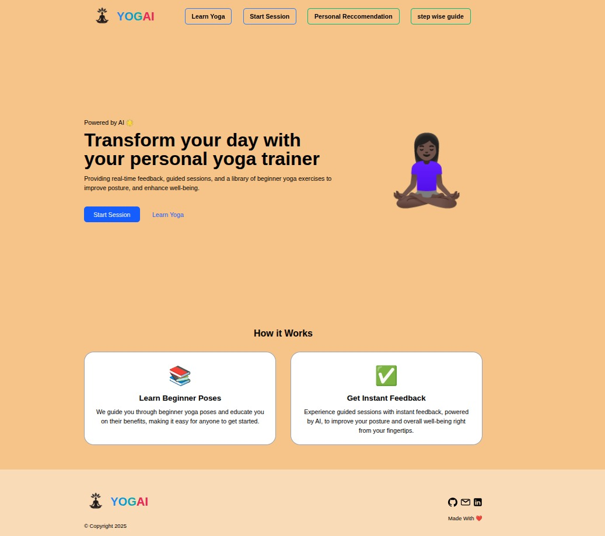
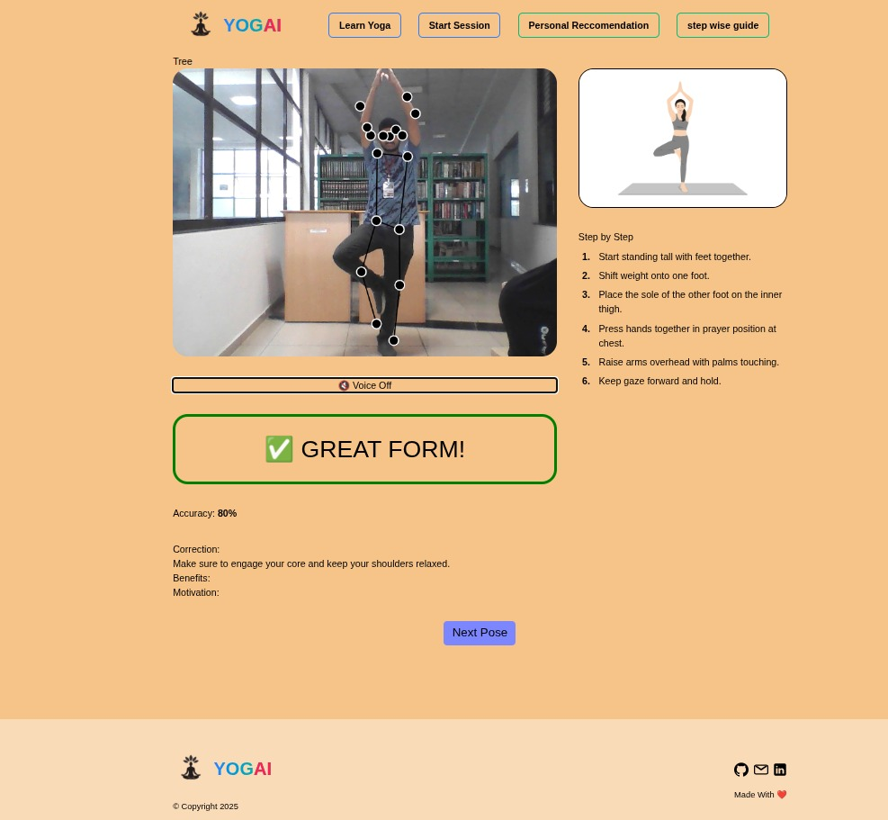
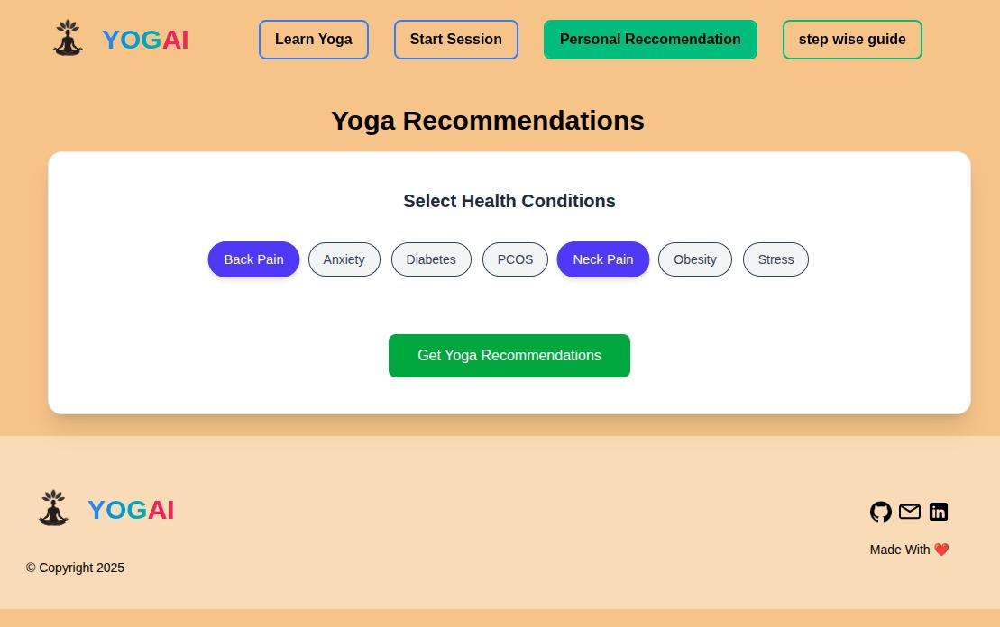

# 🧘‍♀️ Smart Yoga AI Trainer

An intelligent, real-time Yoga Posture Detection and Feedback Web Application powered by **ml5.js**, **p5.js**. This app guides users through yoga poses with instant **visual**, **audio**, and **AI-generated corrections**, supports **multiple asanas**, and provides a **personalized yoga recommendation system** based on health conditions.


## 📸 Screenshots

| Real-Time Pose Detection | Yoga Recommendations |
|--------------------------|-----------------------|
|  |  |  |

---

## 🚀 Features

- ✅ Real-time yoga pose detection using **MoveNet**
- ✅ Multi-asana support (e.g., Tadasana, Vrikshasana, Trikonasana)
- ✅ Live accuracy scoring and visual feedback (color-coded progress)
- ✅ Instant **voice feedback** (toggle on/off)
- ✅ Step-by-step pose learning dashboard
- ✅ AI-powered **health-based yoga recommendations**
- ✅ Pose correction tips using OpenRouter AI
- ✅ Smooth UI/UX built with **React.js + Tailwind CSS**

---

## 🧠 Tech Stack

| Frontend | AI / ML | Other |
|----------|---------|-------|
| React.js | ml5.js, p5.js, TensorFlow.js | Tailwind CSS, Vite, OpenRouter API |

---


---

## 🧩 Installation & Setup

1. **Clone the Repository**
   ```bash
   git clone https://github.com/123Afroj123/YogAi.git
   cd YogAi
2.**Install Dependencies**
```bash
   npm install
```
3.**Start the Development Server**
```bash
   npm run dev
```
4.**Build for Production**   
```bash
   npm run Build
```

**🧪 Usage Guide**
1.Visit the homepage and select a yoga pose or health condition.
2.Enable your camera when prompted.
3.Follow the on-screen visual guide and listen to voice feedback.
4.Review your accuracy score and AI-corrected suggestions.
5.Use the StepWise Guide to learn poses progressively.

**🤖 Powered By**
-ml5.js
-p5.js
-MoveNet by TensorFlow
-OpenRouter (AI suggestions)
-Pixels API (for pose images)

**🙏 Acknowledgments**
-Yoga datasets and pose references
-TensorFlow and OpenAI communities
-Open source contributors and UI/UX inspirations

**Made with ❤️ by CodeFlux**

---
